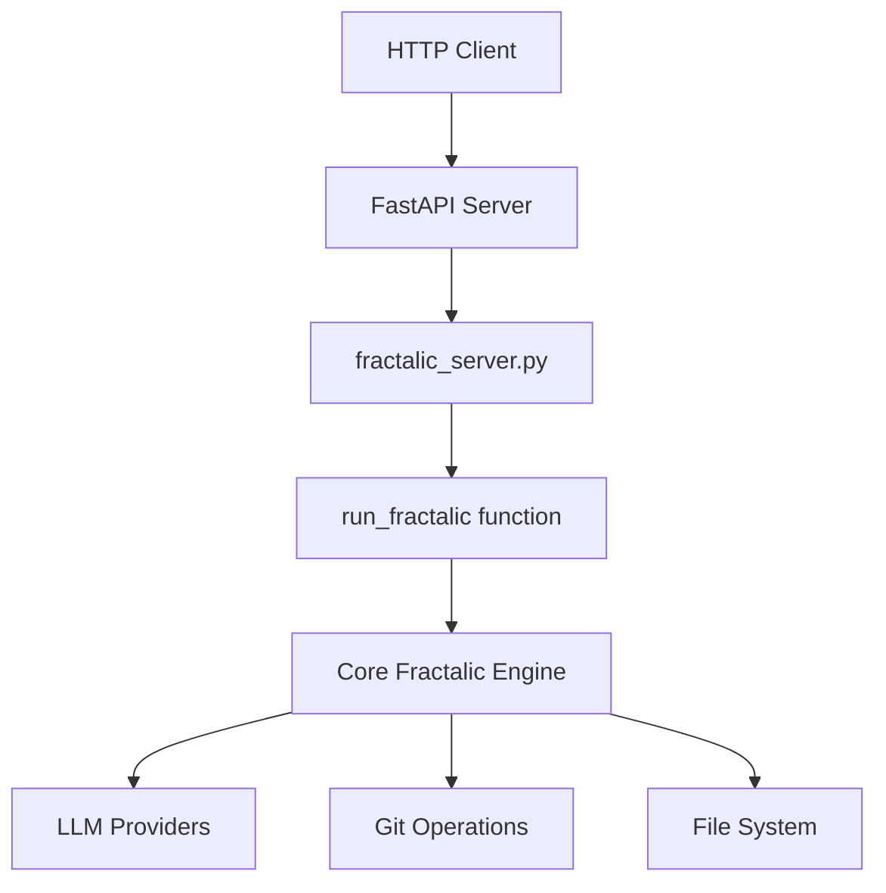

# Fractalic AI Server - Developer Guide

This guide provides technical details for developers working with the Fractalic AI Server implementation, architecture, and extending its functionality.

## Architecture Overview

The Fractalic AI Server is built as a lightweight FastAPI application that provides HTTP access to the core Fractalic execution engine.

### Key Components

```
ai_server/
├── fractalic_server.py    # Main server implementation
└── __pycache__/          # Python cache files

Core Dependencies:
├── fractalic.py          # Core execution engine (run_fractalic function)
├── core/                 # Fractalic core modules
└── settings.toml         # Configuration file
```

### Component Relationships



## Server Implementation

### Main Server Module (`ai_server/fractalic_server.py`)

The server is implemented as a single FastAPI application with the following structure:

```python
from fastapi import FastAPI, HTTPException
from pydantic import BaseModel
from fractalic import run_fractalic

app = FastAPI(title="Fractalic AI Server", version="1.0.0")

class ExecuteRequest(BaseModel):
    filename: str
    parameter_text: Optional[str] = None

@app.post("/execute")
async def execute_script(request: ExecuteRequest):
    # Implementation details...

@app.get("/health")
async def health_check():
    return {"status": "healthy"}
```

### Request Processing Flow

1. **Request Validation**: Pydantic models validate incoming JSON
2. **File Validation**: Check if script file exists
3. **Working Directory Management**: Change to fractalic directory for settings access
4. **Parameter Injection**: Create temporary parameter file if needed
5. **Core Execution**: Call `run_fractalic()` function
6. **Response Formatting**: Format results for HTTP response
7. **Cleanup**: Remove temporary files and restore working directory

### Integration with Core Engine

The server integrates with the refactored `fractalic.py` module:

```python
from fractalic import run_fractalic

result = run_fractalic(
    input_file=request.filename,
    task_file=task_file,              # Temporary parameter file
    param_input_user_request=param_input_user_request,
    capture_output=True               # Server mode flag
)
```

The `run_fractalic()` function returns a dictionary with:
- `success`: Boolean execution status
- `explicit_return`: Whether `@return` operation was used
- `return_content`: Content from `@return` operation
- `branch_name`: Git branch created for execution
- `output`: Execution summary
- `error`: Error message (if failed)

## Development Setup

### Prerequisites

```bash
# Python 3.8+ required
python --version

# Install dependencies
pip install -r requirements.txt

# Key dependencies for server:
# - fastapi
# - uvicorn
# - pydantic
```

### Running in Development Mode

```bash
# Start server with auto-reload
cd /path/to/fractalic
uvicorn ai_server.fractalic_server:app --reload --host 0.0.0.0 --port 8001

# Or use the built-in runner
python ai_server/fractalic_server.py
```

### Testing the Server

```bash
# Health check
curl http://localhost:8001/health

# API documentation
open http://localhost:8001/docs

# Test execution
curl -X POST "http://localhost:8001/execute" \
  -H "Content-Type: application/json" \
  -d '{"filename": "/path/to/test.md"}'
```

## Code Architecture

### Error Handling Strategy

The server implements a multi-layered error handling approach:

```python
try:
    # Validate file exists
    if not os.path.exists(request.filename):
        return error_response("File not found")
    
    # Execute core functionality
    result = run_fractalic(...)
    
    # Handle core execution errors
    if not result.get('success'):
        return error_response(result.get('error'))
    
    # Format successful response
    return success_response(result)
    
except Exception as e:
    # Catch unexpected errors
    return error_response(f"Execution failed: {str(e)}")
```

### Working Directory Management

The server carefully manages working directories to ensure proper operation:

```python
# Change to fractalic directory for settings.toml access
fractalic_dir = os.path.dirname(current_dir)
original_cwd = os.getcwd()

try:
    os.chdir(fractalic_dir)
    # Execute script (which will change to script's directory)
    result = run_fractalic(...)
finally:
    # Always restore original directory
    os.chdir(original_cwd)
```

### Parameter Injection Implementation

Parameters are injected by creating a temporary markdown file:

```python
if request.parameter_text:
    temp_dir = tempfile.mkdtemp()
    task_file = os.path.join(temp_dir, "parameters.md")
    
    with open(task_file, 'w', encoding='utf-8') as f:
        f.write("# Input Parameters {id=input-parameters}\n\n")
        f.write(request.parameter_text)
    
    param_input_user_request = 'input-parameters'
```

## Extending the Server

### Adding New Endpoints

```python
@app.post("/new-endpoint")
async def new_functionality(request: NewRequest):
    """Add new functionality while maintaining consistency."""
    try:
        # Validate request
        # Process with core engine
        # Return formatted response
        pass
    except Exception as e:
        return {"success": False, "error": str(e)}
```

### Custom Response Models

```python
from pydantic import BaseModel
from typing import Optional, List

class ExtendedExecuteResponse(BaseModel):
    success: bool
    explicit_return: bool
    return_content: Optional[str] = None
    branch_name: Optional[str] = None
    output: str
    execution_time: Optional[float] = None
    warnings: List[str] = []
```

### Middleware Integration

```python
from fastapi import Request
import time

@app.middleware("http")
async def add_process_time_header(request: Request, call_next):
    start_time = time.time()
    response = await call_next(request)
    process_time = time.time() - start_time
    response.headers["X-Process-Time"] = str(process_time)
    return response
```

## Production Deployment

### Docker Configuration

```dockerfile
FROM python:3.11-slim

WORKDIR /app
COPY requirements.txt .
RUN pip install -r requirements.txt

COPY . .
EXPOSE 8001

CMD ["python", "ai_server/fractalic_server.py"]
```

### Environment Configuration

```bash
# Environment variables for production
export FRACTALIC_HOST=0.0.0.0
export FRACTALIC_PORT=8001
export FRACTALIC_WORKERS=4
export FRACTALIC_LOG_LEVEL=info
```

### Reverse Proxy Setup (Nginx)

```nginx
upstream fractalic_server {
    server 127.0.0.1:8001;
}

server {
    listen 80;
    server_name your-domain.com;
    
    location / {
        proxy_pass http://fractalic_server;
        proxy_set_header Host $host;
        proxy_set_header X-Real-IP $remote_addr;
        proxy_set_header X-Forwarded-For $proxy_add_x_forwarded_for;
        proxy_timeout 300s;  # LLM operations can take time
    }
}
```

## Testing Framework

### Unit Tests

```python
import pytest
from fastapi.testclient import TestClient
from ai_server.fractalic_server import app

client = TestClient(app)

def test_health_check():
    response = client.get("/health")
    assert response.status_code == 200
    assert response.json() == {"status": "healthy"}

def test_execute_nonexistent_file():
    response = client.post("/execute", json={
        "filename": "/nonexistent/file.md"
    })
    assert response.status_code == 200
    result = response.json()
    assert result["success"] is False
    assert "not found" in result["error"].lower()
```

### Integration Tests

```python
def test_execute_simple_script(tmp_path):
    # Create test script
    script_file = tmp_path / "test.md"
    script_file.write_text("""
# Test Script

@llm
prompt: Say hello
use-header: "# Response"

@return
block: response
    """)
    
    # Execute via API
    response = client.post("/execute", json={
        "filename": str(script_file)
    })
    
    result = response.json()
    assert result["success"] is True
    assert result["explicit_return"] is True
    assert "hello" in result["return_content"].lower()
```

## Performance Considerations

### Optimization Strategies

1. **Connection Pooling**: Reuse HTTP connections for LLM providers
2. **Caching**: Cache provider configurations and settings
3. **Async Operations**: Use async/await for I/O operations
4. **Resource Limits**: Implement request timeouts and size limits

### Monitoring

```python
import time
import logging

logger = logging.getLogger(__name__)

@app.middleware("http")
async def log_requests(request: Request, call_next):
    start_time = time.time()
    response = await call_next(request)
    process_time = time.time() - start_time
    
    logger.info(
        f"{request.method} {request.url.path} "
        f"completed in {process_time:.2f}s "
        f"with status {response.status_code}"
    )
    return response
```

## Security Implementation

### Input Validation

```python
from pydantic import validator, Field

class ExecuteRequest(BaseModel):
    filename: str = Field(..., regex=r'^[/\w\-\.]+\.md$')
    parameter_text: Optional[str] = Field(None, max_length=10000)
    
    @validator('filename')
    def validate_filename(cls, v):
        if not os.path.abspath(v).startswith('/allowed/path/'):
            raise ValueError('File path not allowed')
        return v
```

### Rate Limiting

```python
from slowapi import Limiter, _rate_limit_exceeded_handler
from slowapi.util import get_remote_address

limiter = Limiter(key_func=get_remote_address)
app.state.limiter = limiter
app.add_exception_handler(RateLimitExceeded, _rate_limit_exceeded_handler)

@app.post("/execute")
@limiter.limit("10/minute")
async def execute_script(request: Request, execute_request: ExecuteRequest):
    # Implementation...
```

## Debugging and Troubleshooting

### Debug Mode

```python
import logging

# Enable debug logging
logging.basicConfig(level=logging.DEBUG)

# Add debug information to responses
if debug_mode:
    result['debug_info'] = {
        'working_directory': os.getcwd(),
        'script_directory': script_dir,
        'temp_files': temp_files_created
    }
```

### Common Issues

1. **Import Errors**: Ensure fractalic module is in Python path
2. **File Permissions**: Server process needs read access to script files
3. **Working Directory**: Scripts execute in their containing directory
4. **API Key Issues**: Check settings.toml configuration
5. **Port Conflicts**: Server auto-tries ports 8001-8004

### Logging Configuration

```python
import logging
from logging.handlers import RotatingFileHandler

# Configure structured logging
handler = RotatingFileHandler(
    'logs/fractalic_server.log', 
    maxBytes=10000000, 
    backupCount=5
)
handler.setFormatter(logging.Formatter(
    '%(asctime)s %(levelname)s %(name)s %(message)s'
))

logger = logging.getLogger('fractalic_server')
logger.addHandler(handler)
logger.setLevel(logging.INFO)
```

## Contributing

### Code Style

- Follow PEP 8 Python style guidelines
- Use type hints for all function parameters and returns
- Add docstrings for all public functions
- Maintain consistent error handling patterns

### Pull Request Process

1. Create feature branch from main
2. Implement changes with tests
3. Update documentation
4. Ensure all tests pass
5. Submit pull request with clear description

### Development Workflow

```bash
# Set up development environment
git clone <repository>
cd fractalic
python -m venv venv
source venv/bin/activate
pip install -r requirements.txt

# Run tests
python -m pytest tests/

# Start development server
python ai_server/fractalic_server.py

# Code formatting
black ai_server/
isort ai_server/
```

This server implementation provides a clean, maintainable interface to the Fractalic execution engine while following FastAPI best practices and maintaining compatibility with the core system.
