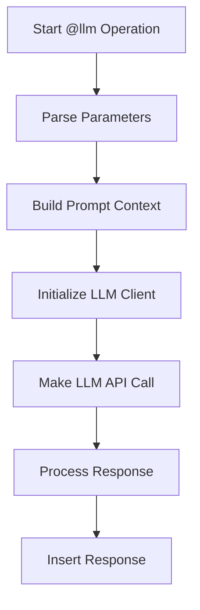

# LLM Operation

1. **Core Components**:
- The system uses a modular LLM client architecture with support for multiple providers (OpenAI, Anthropic, Groq)
- The main LLM operation is handled by `process_llm()` in `core/operations/llm_op.py`
- Each provider has its own client implementation in `core/llm/providers/`

2. **Operation Parameters**:
The `@llm` operation accepts several parameters:
- `prompt`: Direct text prompt for the LLM
- `block`: Reference to existing blocks in the document to use as context
- `media`: Array of media files to include with the prompt
- `provider`: Override for the default LLM provider
- `model`: Override for the specific model to use
- `temperature`: Control randomness in responses (0-1)
- `save-to-file`: Path to save raw response
- `use-header`: Custom header for the response block
- `mode`: How to insert response (`append`, `prepend`, `replace`)
- `to`: Target block where response should be placed

3. **Execution Flow**:


4. **Key Features**:
- Supports both direct prompts and block references
- Can combine multiple blocks and prompts
- Handles media attachments (images, documents)
- Maintains conversation context through message history
- Supports different response insertion modes
- Can save raw responses to files
- Provides progress feedback during execution

5. **Example Usage**:
```yaml
@llm
prompt: "Generate a summary of the following text:"
block: "content/section"
media: 
  - "images/diagram.png"
provider: "anthropic"
model: "claude-3-sonnet"
temperature: 0.7
save-to-file: "output/response.txt"
use-header: "# Analysis Results"
mode: "append"
to: "results/summary"
```

6. **Provider-Specific Handling**:
- Each provider (OpenAI, Anthropic, Groq) has its own client implementation
- Providers handle message formatting and API calls differently
- System automatically manages API keys and settings through configuration

7. **Error Handling**:
- Validates required parameters
- Handles API errors gracefully
- Provides detailed error messages
- Maintains operation state for debugging

8. **Integration with Document Structure**:
- Works with the system's AST (Abstract Syntax Tree)
- Can reference and modify document blocks
- Maintains document structure during operations
- Supports nested block references

This operation is designed to be flexible and powerful, allowing for various LLM interactions while maintaining document structure and context.

1. **Context Building Modes**:
The system builds context in three different ways depending on the parameters provided:

a) **Block-Based Context**:
```yaml
@llm
block: "section/content"
```
- When only `block` is specified:
  - System extracts content from the referenced block(s)
  - If multiple blocks are specified, they are stacked together
  - No additional context is added
  - Each node's content becomes a separate message with the specified role

b) **Prompt-Based Context**:
```yaml
@llm
prompt: "Your prompt here"
```
- When only `prompt` is specified:
  - System automatically includes all previous heading nodes as context
  - Previous headings are added as messages with their respective roles
  - The prompt is added as the final message
  - Context is built as: `[all previous headings] + prompt`

c) **Combined Context**:
```yaml
@llm
prompt: "Your prompt"
block: 
  - "section1/*"
  - "section2/*"
```
- When both `prompt` and `block` are specified:
  - System stacks content in order: `[specified blocks] + prompt`
  - Each block's content is added as separate messages
  - The prompt is added as the final message

2. **Message Structure**:
The system builds two parallel structures:
- `prompt_parts`: A list of text content for traditional prompt format
- `messages`: A list of structured messages with roles for chat format

3. **Block Processing**:
```python
if block_params:
    if block_params.get('is_multi'):
        # Handle array of blocks
        blocks = block_params.get('blocks', [])
        for block_info in blocks:
            block_uri = block_info.get('block_uri')
            nested_flag = block_info.get('nested_flag', False)
            block_ast = get_ast_part_by_path(ast, block_uri, nested_flag)
            # Process block content and add to messages
    else:
        # Handle single block
        block_uri = block_params.get('block_uri')
        nested_flag = block_params.get('nested_flag', False)
        block_ast = get_ast_part_by_path(ast, block_uri, nested_flag)
        # Process block content and add to messages
```

4. **Previous Headings Context**:
```python
def get_previous_headings(node: Node) -> str:
    context = []
    current = ast.first()
    while current and current != node:
        if current.type == NodeType.HEADING:
            context.append(current.content)
        current = current.next
    return "\n\n".join(context)

def get_previous_heading_messages(node: Node) -> list:
    messages = []
    current = ast.first()
    while current and current != node:
        role = getattr(current, "role", "user")
        messages.append({"role": role, "content": current.content})
        current = current.next
    return messages
```

5. **Final Context Assembly**:
```python
# Combine all parts with proper spacing
prompt_text = "\n\n".join(part.strip() for part in prompt_parts if part.strip())

# Add prompt if specified (always last)
if prompt:
    prompt_parts.append(prompt)
    messages.append({"role": "user", "content": prompt})
```

6. **Provider-Specific Handling**:
Each provider (OpenAI, Anthropic, Groq) handles the context differently:
- OpenAI: Uses chat completion format with system/user/assistant messages
- Anthropic: Supports both message format and traditional prompt format
- Groq: Similar to OpenAI's chat completion format

7. **Media Integration**:
If media files are specified:
```yaml
@llm
prompt: "Analyze this image"
media: 
  - "images/diagram.png"
```
- Media is attached to the first user message
- Each provider handles media attachments according to their API requirements

This context building system ensures that the LLM receives appropriate context while maintaining the document's structure and relationships between different parts of the content.
