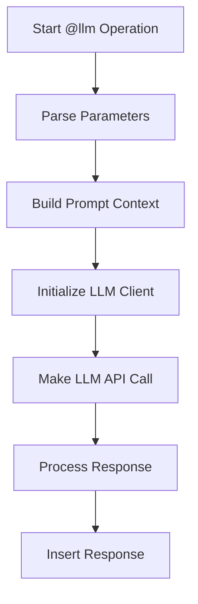

# LLM Operation

1. **Core Components**:
- The system uses a modular LLM client architecture with support for multiple providers (OpenAI, Anthropic, Groq)
- The main LLM operation is handled by `process_llm()` in `core/operations/llm_op.py`
- Each provider has its own client implementation in `core/llm/providers/`

2. **Operation Parameters**:
The `@llm` operation accepts several parameters:
- `prompt`: Direct text prompt for the LLM
- `block`: Reference to existing blocks in the document to use as context
- `media`: Array of media files to include with the prompt
- `provider`: Override for the default LLM provider
- `model`: Override for the specific model to use
- `temperature`: Control randomness in responses (0-1)
- `save-to-file`: Path to save raw response
- `use-header`: Custom header for the response block
- `mode`: How to insert response (`append`, `prepend`, `replace`)
- `to`: Target block where response should be placed

3. **Execution Flow**:


4. **Key Features**:
- Supports both direct prompts and block references
- Can combine multiple blocks and prompts
- Handles media attachments (images, documents)
- Maintains conversation context through message history
- Supports different response insertion modes
- Can save raw responses to files
- Provides progress feedback during execution

5. **Example Usage**:
```yaml
@llm
prompt: "Generate a summary of the following text:"
block: "content/section"
media: 
  - "images/diagram.png"
provider: "anthropic"
model: "claude-3-sonnet"
temperature: 0.7
save-to-file: "output/response.txt"
use-header: "# Analysis Results"
mode: "append"
to: "results/summary"
```

6. **Provider-Specific Handling**:
- Each provider (OpenAI, Anthropic, Groq) has its own client implementation
- Providers handle message formatting and API calls differently
- System automatically manages API keys and settings through configuration

7. **Error Handling**:
- Validates required parameters
- Handles API errors gracefully
- Provides detailed error messages
- Maintains operation state for debugging

8. **Integration with Document Structure**:
- Works with the system's AST (Abstract Syntax Tree)
- Can reference and modify document blocks
- Maintains document structure during operations
- Supports nested block references

This operation is designed to be flexible and powerful, allowing for various LLM interactions while maintaining document structure and context.

## Context Building Process

### 1. Block Processing Logic
When processing blocks, the system follows these steps:

1. **Single Block Processing**:
   - Retrieves the block content using the provided block URI
   - Checks if nested blocks should be included
   - Extracts all content from the block's nodes
   - Combines the content with proper spacing
   - Creates messages for each node with appropriate roles

2. **Multiple Block Processing**:
   - Handles an array of block references
   - Processes each block individually
   - Maintains the order of blocks as specified
   - Combines all block contents sequentially
   - Preserves individual block roles and message structure

### 2. Previous Headings Context
When building context from previous headings, the system:

1. **Content Collection**:
   - Traverses the document from the beginning up to the current node
   - Identifies all heading nodes encountered
   - Preserves the hierarchical structure of headings
   - Maintains the original order of headings

2. **Message Formation**:
   - Creates messages for each heading
   - Preserves the role of each heading (defaults to "user" if not specified)
   - Maintains the chronological order of messages
   - Ensures proper spacing between heading contents

### 3. Final Context Assembly
The system combines all context elements in the following order:

1. **Block Content** (if specified):
   - Adds all block contents first
   - Maintains proper spacing between blocks
   - Preserves block-specific roles

2. **Previous Headings** (if no blocks specified):
   - Adds all previous heading content
   - Maintains heading hierarchy
   - Preserves heading roles

3. **Prompt** (if specified):
   - Always adds the prompt last
   - Sets the prompt role as "user"
   - Ensures proper separation from previous content

### 4. Provider-Specific Handling
Each provider handles the context differently:

1. **OpenAI**:
   - Uses chat completion format
   - Supports system/user/assistant message roles
   - Handles context through message history
   - Maintains conversation flow through structured messages

2. **Anthropic**:
   - Supports both message format and traditional prompt format
   - Handles media attachments in message content
   - Uses system prompt for additional context
   - Maintains conversation state through message history

3. **Groq**:
   - Similar to OpenAI's chat completion format
   - Supports message history and roles
   - Handles context through structured messages
   - Maintains conversation flow through message history

### 5. Media Integration
When media files are specified:
- Media is attached to the first user message
- Each provider handles media attachments according to their API requirements
- Media content is properly formatted for each provider's specific needs
- Maintains proper context and relationships between text and media

This context building system ensures that the LLM receives appropriate context while maintaining the document's structure and relationships between different parts of the content.
