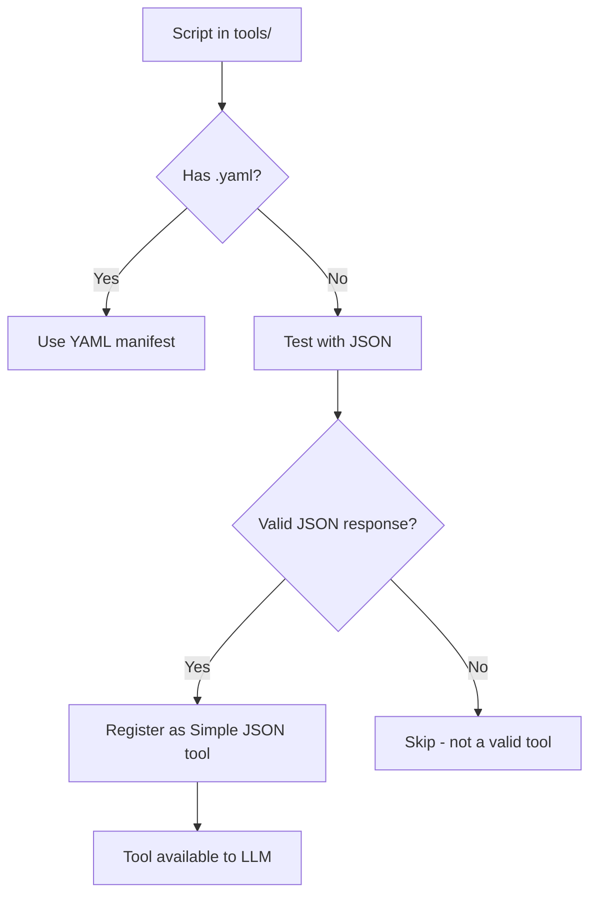

# Fractalic – Tool Plug-in & Auto-Discovery Guide

### Contents

1. Why tools are first-class citizens in Fractalic
2. How the registry builds the master tool list
3. Two ways to publish a tool
4. Contract for Python & Bash scripts (auto-discovery mode)
5. End-to-end life-cycle of a tool call
6. Using Model-Context-Protocol (MCP) servers
7. FAQ & troubleshooting

> **📋 For detailed technical specifications on building autodiscoverable tools, see the [Autodiscoverable Tools Technical Specification Document (TSD)](./autodiscoverable-tools-tsd.md)**

---

## 1.  Why tools are first-class citizens in Fractalic

Fractalic’s workflows are driven by LLM-calls (`@llm`), which can
**delegate subtasks**—run a shell command, fetch data, resize an image, etc.—by
invoking *tools*.
Instead of hard-coding every helper function in Python, we expose them to the
model through the OpenAI “function-calling” / “tools” interface.
Benefits:

* **Plug-ins, not deployments** – drop a script into `tools/`, restart, done.
* **Language-agnostic** – Bash, Python, Go, even remote micro-services can be
  called the same way.
* **Self-documenting** – the registry produces the JSON schema the LLM needs,
  so prompt-engineering stays declarative.

---

## 2.  How the registry builds the master tool list

```mermaid
graph TD
  A[1. YAML manifests] --> C(Merge)
  B[2. Auto-discover<br>*.py / *.sh] --> C
  D[3. MCP servers] --> C
  C --> E[Master list<br>(schema + callables)]
```

* **Step 1 – YAML manifests**
  Every `*.yaml` file in `tools/` is parsed first. They can override names,
  types, descriptions—think of them as *authoritative declarations*.

* **Step 2 – Auto-discovery**
  Any `*.py` or `*.sh` **without** a companion YAML is inspected:
  the registry runs `script --help`, extracts a one-line summary + flags,
  synthesises a schema, and stores a Python wrapper that knows how to call the
  script.

* **Step 3 – MCP servers** *(optional)*
  If the client was started with

  ```python
  liteclient(..., mcp_servers=["http://tools.mycorp:8900"])
  ```

  the registry fetches `/list_tools` from each server and merges those
  manifests behind local ones.

---

## 3.  Two ways to publish a tool

| Mode                  | When to choose                                                                 | What you write                               |
| --------------------- | ------------------------------------------------------------------------------ | -------------------------------------------- |
| **Explicit manifest** | You want a custom name, rich type hints, or the script can’t produce `--help`. | A short YAML + any script / Python function. |
| **Auto-discover**     | You control the script and are OK to follow the help-text contract.            | **Only the script** – no YAML required.      |

### 3.1  Explicit manifest example

```yaml
# tools/img_resize.yaml
name: resize_image
description: "Resize and save an image to disk"
command: python-cli          # python / python-cli / bash-cli / bash / mcp
entry: tools/resize.py
parameters:
  type: object
  properties:
    infile:  {type: string, description: "Path to source image"}
    width:   {type: integer}
    outfile: {type: string}
  required: [infile, width]
```

### 3.2  Auto-discover example

```python
# tools/weather.py
"""
Simple weather fetcher (first non-blank line becomes the description)
"""
import argparse, json, requests

# Optional: implement get_tool_schema and support --fractalic-dump-schema
# def get_tool_schema():
#     return { ... }

ap = argparse.ArgumentParser(description="Simple weather fetcher")
ap.add_argument("--lat", required=True, help="Latitude of the location (e.g., 48.8566)")
ap.add_argument("--lon", required=True, help="Longitude of the location (e.g., 2.3522)")
ap.add_argument("--fractalic-dump-schema", action="store_true", help=argparse.SUPPRESS)
args = ap.parse_args()

url = (
    f"https://api.open-meteo.com/v1/forecast"
    f"?latitude={args.lat}&longitude={args.lon}&current=temperature_2m"
)
print(requests.get(url, timeout=5).text)
```

*No YAML file present → registry auto-discovers via `get_tool_schema()` or falls back to `--help`.*

---

## 4.  Simple JSON Schema Discovery Contract

Fractalic uses **Simple JSON Schema Discovery** for automatic tool registration. This is the ONLY supported approach for autodiscoverable tools.

### 4.1 Simple JSON Convention Requirements

All autodiscoverable tools must implement the Simple JSON convention:

#### **Mandatory Requirements:**
| Requirement | Implementation |
|-------------|----------------|
| **Test response** | Must respond to `'{"__test__": true}'` with valid JSON |
| **JSON I/O** | Accept JSON as single argument, output JSON to stdout |
| **Error handling** | Return errors as JSON: `{"error": "message"}` |
| **Fast response** | Must respond within 200ms to avoid timeout |

#### **Optional Enhancements:**
| Feature | Implementation |
|---------|----------------|
| **Schema dump** | Support `--fractalic-dump-schema` for rich parameter definitions |
| **UTF-8 Support** | Use `ensure_ascii=False` in `json.dumps()` |

### 4.2 Simple JSON Template

```python
#!/usr/bin/env python3
"""Tool description goes here."""
import json, sys

def process_data(data):
    """Main processing function."""
    action = data.get("action")
    if action == "example":
        return {"result": "success", "data": data.get("param", "default")}
    return {"error": f"Unknown action: {action}"}

def main():
    # Test mode for autodiscovery
    if len(sys.argv) == 2 and sys.argv[1] == '{"__test__": true}':
        print(json.dumps({"success": True, "_simple": True}))
        return
    
    # Optional: Schema dump for rich LLM integration
    if len(sys.argv) == 2 and sys.argv[1] == "--fractalic-dump-schema":
        schema = {
            "description": "Tool description",
            "parameters": {
                "type": "object",
                "properties": {
                    "action": {"type": "string", "enum": ["example"], "description": "Action to perform"},
                    "param": {"type": "string", "description": "Optional parameter"}
                },
                "required": ["action"]
            }
        }
        print(json.dumps(schema, ensure_ascii=False))
        return
    
    # Process JSON input
    try:
        if len(sys.argv) != 2:
            raise ValueError("Expected exactly one JSON argument")
        params = json.loads(sys.argv[1])
        result = process_data(params)
        print(json.dumps(result, ensure_ascii=False))
    except Exception as e:
        print(json.dumps({"error": str(e)}, ensure_ascii=False))
        sys.exit(1)

if __name__ == "__main__": 
    main()
```

### 4.3 Tool Discovery Process



**Important Notes:**
- Tools that don't respond to the JSON test are **automatically skipped**
- Helper modules and incomplete scripts are filtered out automatically
- Only tools that implement the Simple JSON convention are registered
- Response time must be under 200ms to avoid timeout
- **Parameter validation**: Type constraints, enums, required fields
- **Error handling**: Structured error responses

---

## 5.  Life-cycle of a tool call

1. **Registry produces schema list** and passes it to LiteLLM (`tools=`).
2. **Model replies** with

   ```json
   {
     "tool_calls": [{
        "id":"abc", "function":{"name":"weather","arguments":"{\"lat\":...}"}
   }]}
   ```
3. **lite\_client** looks up `registry["weather"]`, unpacks the JSON arguments,
   runs the wrapper, captures stdout.
4. The result is wrapped as a `"tool"` message and returned to the model.
5. Model integrates the data into the next normal chat turn, or calls another
   tool.

---

## 6.  MCP servers – zero-friction extension

* Local and MCP tools share the **exact same manifest format**.

* The registry simply does:

  ```python
  for srv in mcp_servers:
      for manifest in requests.get(f"{srv}/list_tools").json():
          self._register(manifest, from_mcp=True)
  ```

* Execution is proxied back to the server via `POST /call_tool`.

* Local manifests **override** remote ones if names collide.

---

## 7.  FAQ & troubleshooting

| Symptom                                               | Likely cause                                      | Fix                                                               |
| ----------------------------------------------------- | ------------------------------------------------- | ----------------------------------------------------------------- |
| Tool appears in debug list but has empty `properties` | Script prints nothing (or malformed) on `--help`. | Add a proper help block **or** create a YAML manifest.            |
| JSON schema shows a `help` parameter                  | Older manifest or regex matched `--help`.         | Update script; registry now removes it automatically.             |
| Script executed but model sees only `stdout` string   | Script prints plain text.                         | Switch to `echo '{"result": …}'` for structured replies.          |
| Remote MCP tools never appear                         | Network / auth issue.                             | Test `curl http://server/list_tools` manually; check server logs. |

---

## 8.  Common Pitfalls & Best Practices for Auto-Discoverable Tools

### Problems Encountered

1. **Server hangs or slow autodiscovery**: Caused by heavy imports or blocking code at the top level, or not handling introspection flags (`--help`, `--fractalic-dump-schema`, etc.) early.
2. **Wrong working directory**: Tools created SQLite DBs or config files in the wrong place when run from a parent directory.
3. **Mixed output (logs + JSON)**: Tools printed both debug/info and JSON result to stdout, causing double-encoded JSON or messy output.
4. **Argument style mismatch**: Tools failed when called with a positional function name instead of a flag (e.g., `telegram_get_chats` vs `--function get_chats`).

### Best-Practice Recommendations

- **Fast introspection**: Move heavy imports inside functions/classes. At the top of your script, check for introspection flags and exit quickly if present.
- **Set working directory**: At the top of your script, add:
  ```python
  import os, sys
  os.chdir(os.path.dirname(os.path.abspath(__file__)))
  ```
- **Clean output**: Only print the final JSON result to stdout. All debug/info/log messages should go to stderr (e.g., `print("info", file=sys.stderr)`) or use the `logging` module.
- **CLI compatibility**: Support both positional and flag-based invocation styles:
  ```python
  TOOL_NAME_MAP = {"telegram_get_chats": "get_chats", ...}
  if len(sys.argv) > 1 and sys.argv[1] in TOOL_NAME_MAP:
      sys.argv = [sys.argv[0], "--function", TOOL_NAME_MAP[sys.argv[1]]] + sys.argv[2:]
  ```
- **Schema dump support**: Implement `--fractalic-dump-schema` and `--fractalic-dump-multi-schema` for fast, structured introspection.
- **Error handling**: Return errors as structured JSON, not as plain text.

> Following these practices ensures your tool is robust, fast, and fully compatible with Fractalic’s auto-discovery and LLM workflows.

---

## TL;DR for tool authors

### Recommended: Simple JSON Convention
> 1. Write a script that **accepts JSON input** and **returns JSON output**.
> 2. Handle test mode: `'{"__test__": true}'` → `{"success": true, "_simple": true}`
> 3. Drop it under `tools/` (no YAML required for autodiscovery).
> 4. Restart Fractalic (or call `registry.rescan()`).
> 5. The LLM can now invoke your script with any JSON parameters—done!

### Legacy Approach (Backward Compatibility)
> 1. Write a script that **prints helpful `--help` text**, **returns JSON on stdout**, and **implements `get_tool_schema()` with `--fractalic-dump-schema` support**.
> 2. Drop it under `tools/` (no YAML required for autodiscovery).
> 3. Restart Fractalic (or call `registry.rescan()`).
> 4. The LLM can now invoke your script as `tool_name(flag=value, …)`—done!
